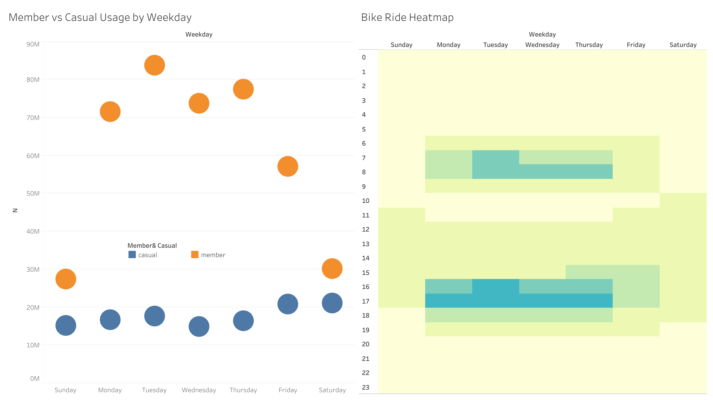

# Introduction

This is my first data analysis report, completed as part of the **Google Data Analytics Professional Certificate** on Coursera.  
The analysis explores the usage patterns of a public bike-sharing system, focusing on **members and casual riders** across weekdays and times of day.

---

# Findings

## Member vs Casual Usage by Weekday:

In this chart, we can see that **members use bikes much more on weekdays**, especially peaking on **Tuesday**.  
Casual riders show a more balanced pattern, preferring weekends slightly more.  
Perhaps everyone is still tired on Monday and becomes active on Tuesday. 

To visualize the data clearly, I used Tableau to create the following chart, which shows an interesting pattern: member usage peaks on Tuesday.

---

## About Bike Ride Heatmap

The heatmap shows bike activity intensity by hour and weekday.  
We can observe two clear peaks:
- Morning (around 7–9 AM) — likely due to commuting.
- Evening (around 5–7 PM) — another commute or leisure time.
Weekends have a more dispersed pattern, with activity spread out during the day.

---

# Conclusion

This analysis found that **members of the bike-sharing program are most active on Tuesdays**, rather than Mondays.  
This insight suggests that demand peaks after the start of the week, which could inform planning and resource allocation to better meet rider needs.

